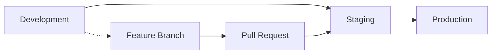

# Navi Gym CI/CD Documentation

This document describes the CI/CD pipeline and Docker-based development workflow for Navi Gym.

## Overview

The CI/CD system provides:
- **Docker-based builds** for multiple platforms and GPU configurations
- **Automated testing** in containerized environments
- **Multi-architecture support** (x86_64 and ARM64)
- **Security scanning** and vulnerability assessment
- **Automated deployment** workflows
- **Release management** with GitHub integration

## Quick Start

### Prerequisites

- Docker 20.10+
- Docker Buildx
- Make (optional, for convenience commands)
- Git

### Basic Usage

```bash
# Build default image
make build

# Build all variants
make build-all

# Run tests
make test

# Quick validation
make quick-test
```

## Docker Images

### Available Variants

| Variant | Description | Docker Tag |
|---------|-------------|------------|
| **Default** | CPU-only, multi-platform | `navi-gym:latest` |
| **NVIDIA** | NVIDIA GPU support | `navi-gym:nvidia-latest` |
| **AMD** | AMD GPU/ROCm support | `navi-gym:amd-latest` |
| **Multi-arch** | ARM64 + x86_64 | `navi-gym:multiarch-latest` |

### Building Images

#### Using Make (Recommended)

```bash
# Build specific variants
make build-nvidia          # NVIDIA GPU
make build-amd             # AMD GPU  
make build-multiarch       # Multi-architecture

# Build with custom parameters
make build TAG=v1.0.0 PYTHON_VERSION=3.10
```

#### Using Build Scripts

```bash
# Basic build
./scripts/build-docker.sh

# NVIDIA GPU build
./scripts/build-docker.sh --nvidia --tag nvidia-latest

# AMD GPU build  
./scripts/build-docker.sh --amd --tag amd-latest

# Multi-architecture build
./scripts/build-docker.sh --multiarch --push --registry ghcr.io/navichat
```

#### Manual Docker Commands

```bash
# Default image
docker build -f docker/Dockerfile -t navi-gym:latest .

# NVIDIA GPU image
docker build -f docker/Dockerfile -t navi-gym:nvidia-latest .

# AMD GPU image
docker build -f docker/Dockerfile.amdgpu -t navi-gym:amd-latest .
```

## Testing

### Test Suites

| Suite | Description | Usage |
|-------|-------------|-------|
| **smoke** | Quick validation tests | `make test-smoke` |
| **unit** | Unit tests | `make test-unit` |
| **integration** | Integration tests | `make test-integration` |
| **benchmarks** | Performance benchmarks | `make test-benchmarks` |
| **all** | Complete test suite | `make test` |

### Running Tests

#### Using Make

```bash
# Run all tests
make test

# Run specific test suite
make test-unit
make test-integration
make test-benchmarks

# Test GPU functionality
make test-gpu
```

#### Using Test Scripts

```bash
# Run all tests
./scripts/run-tests.sh

# Run specific suite with verbose output
./scripts/run-tests.sh --suite unit --verbose

# Run tests on specific image
./scripts/run-tests.sh --image navi-gym:nvidia-latest --suite integration

# Custom configuration
./scripts/run-tests.sh \
  --suite benchmarks \
  --timeout 3600 \
  --output-dir ./my-results \
  --jobs 4
```

#### Docker Compose Testing

```bash
# Run tests using docker-compose
docker-compose up test-runner

# View test results
docker-compose logs test-runner
```

## Development Workflow

### Local Development

#### Using Docker Compose

```bash
# Start development environment
docker-compose up -d navi-gym

# Access container shell
docker-compose exec navi-gym bash

# For NVIDIA GPU development
docker-compose up -d navi-gym-nvidia
docker-compose exec navi-gym-nvidia bash

# For AMD GPU development  
docker-compose up -d navi-gym-amd
docker-compose exec navi-gym-amd bash
```

#### Using Make Commands

```bash
# Open shell in container
make shell                 # Default
make shell-nvidia          # NVIDIA GPU
make shell-amd             # AMD GPU

# Set up local development environment
make dev-setup
source venv/bin/activate
```

### Jupyter Notebooks

```bash
# Start Jupyter service
docker-compose up -d jupyter

# Access at http://localhost:8888
# No password required in development mode
```

### Documentation

```bash
# Start documentation server
docker-compose up -d docs

# Access at http://localhost:8000
# Auto-reloads on file changes
```

## CI/CD Workflows

### GitHub Actions Workflows

#### 1. Docker CI (`docker-ci.yml`)

**Triggers:**
- Push to `main` or `develop`
- Pull requests
- Tags starting with `v*`

**Jobs:**
- Build and test Docker images
- Multi-architecture builds
- Security scanning
- Integration tests

#### 2. Deploy (`deploy.yml`)

**Triggers:**
- Tags starting with `v*`
- Manual dispatch
- Releases

**Jobs:**
- Staging deployment
- Production deployment
- Multi-arch release builds
- GitHub release creation

#### 3. Generic (`generic.yml`)

**Triggers:**
- Pull requests to `main`

**Jobs:**
- Cross-platform testing
- Python version compatibility
- Code formatting checks

### Workflow Configuration

#### Environment Variables

```yaml
env:
  REGISTRY: ghcr.io
  IMAGE_NAME: ${{ github.repository }}
  PYTHON_VERSION: 3.11
```

#### Secrets Required

- `GITHUB_TOKEN`: Automatically provided
- `WANDB_API_KEY`: For benchmark tracking (optional)
- `HF_TOKEN`: For Hugging Face integration (optional)

## Deployment

### Registry Configuration

Images are pushed to GitHub Container Registry (ghcr.io) by default.

```bash
# Login to registry
echo $GITHUB_TOKEN | docker login ghcr.io -u $GITHUB_ACTOR --password-stdin

# Push images
docker push ghcr.io/navichat/navi-gym:latest
```

### Release Process

1. **Create Release Tag**
   ```bash
   git tag -a v1.0.0 -m "Release v1.0.0"
   git push origin v1.0.0
   ```

2. **Automated Actions**
   - Multi-arch images built
   - Security scanning performed
   - Images pushed to registry
   - GitHub release created
   - Release notes generated

3. **Manual Release**
   ```bash
   make release-prepare
   make release-build
   ```

### Environment Promotion



## Performance Optimization

### Build Optimization

- **Multi-stage builds** reduce final image size
- **Build caching** speeds up CI/CD
- **Layer optimization** minimizes rebuild time

### Testing Optimization

- **Parallel test execution** with pytest-xdist
- **Smart test selection** based on changes
- **Cached test environments**

### Resource Management

```bash
# Monitor resource usage
make status

# Clean up resources
make clean

# Full cleanup (careful!)
make clean-all
```

## Troubleshooting

### Common Issues

#### Build Failures

```bash
# Check Docker daemon
docker info

# Clean build cache
docker builder prune

# Rebuild from scratch
docker build --no-cache -f docker/Dockerfile -t navi-gym:latest .
```

#### Test Failures

```bash
# Run tests with verbose output
./scripts/run-tests.sh --suite unit --verbose

# Check test results
cat test-results/test-report.md

# Debug in container
make shell
```

#### GPU Issues

```bash
# Check NVIDIA runtime
docker run --rm --gpus all nvidia/cuda:11.8-runtime-ubuntu20.04 nvidia-smi

# Check AMD/ROCm
docker run --rm --device=/dev/kfd --device=/dev/dri rocm/pytorch:latest rocm-smi
```

### Debug Commands

```bash
# System status
make status
make info

# Docker system information
docker system df
docker system events

# Container inspection
docker inspect navi-gym:latest
```

## Security

### Security Scanning

```bash
# Run security scan
make security-scan

# Lint Dockerfiles
make lint
```

### Best Practices

- **Minimal base images** reduce attack surface
- **Non-root users** in containers
- **Secret management** via GitHub secrets
- **Regular dependency updates**
- **Vulnerability scanning** in CI/CD

## Monitoring and Logging

### Test Results

- XML test reports in `test-results/`
- GitHub Actions artifacts
- Performance benchmarks tracked

### Build Metrics

- Build times tracked
- Image sizes monitored
- Success/failure rates

### Deployment Monitoring

- Health checks after deployment
- Rollback procedures
- Alert notifications

## Contributing

### Adding New Tests

1. Create test files in `tests/`
2. Update test suites in `run-tests.sh`
3. Add to CI workflows if needed

### Modifying Docker Images

1. Update Dockerfiles in `docker/`
2. Test locally with `make build`
3. Update documentation
4. Submit pull request

### Workflow Updates

1. Modify `.github/workflows/`
2. Test with workflow dispatch
3. Document changes
4. Review security implications

## Support

For issues and questions:

1. Check [Troubleshooting](#troubleshooting) section
2. Review [GitHub Issues](https://github.com/navichat/Navi_Gym/issues)
3. Create new issue with:
   - Environment details
   - Error messages
   - Reproduction steps
   - Expected vs actual behavior